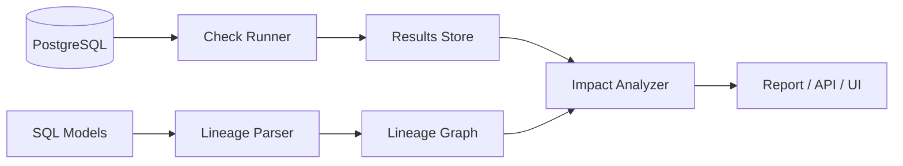

# Data Quality & Lineage Platform

**When a data check fails, instantly see what broke, why, and which dashboards are affected.**

  

## The Problem

Data teams find out about bad data from angry stakeholders, not from their tools. Quality checks tell you a table is broken, but not **where the problem started** or **who is impacted**. Engineers then spend hours tracing SQL by hand.

## The Idea

Combine two things that are usually separate tools:

1. **Data quality checks** (nulls, duplicates, freshness, volume and distribution anomalies)
2. **Automatic column-level lineage** parsed straight from your SQL

When a check fails, the platform walks the lineage graph and reports the **root cause candidates upstream** and the **blast radius downstream**.

## Key Features

- Checks defined in simple YAML (not buried in code)
- Statistical anomaly detection on row counts and metric drift (rolling median + MAD)
- Column-level lineage extracted from SQL using `sqlglot`
- Failure report: "orders.total_amount is null in 12% of rows. Upstream: stg_payments. Impacted: revenue_daily, exec_dashboard."
- CLI and REST API (FastAPI)
- Lineage graph viewer in the browser

## Architecture



## Tech Stack

Python, FastAPI, PostgreSQL, sqlglot, NetworkX, pytest, Docker, GitHub Actions

## Quick Start

```bash
git clone https://github.com/Ghazi1212/data-quality-lineage-platform.git
cd data-quality-lineage-platform
docker compose up -d          # starts Postgres + demo data
pip install -r requirements.txt
dqlp run --config examples/checks.yaml
dqlp lineage --model revenue_daily
```

## Example Check

```yaml
table: orders
checks:
  - not_null: [order_id, total_amount]
  - unique: [order_id]
  - freshness: {column: created_at, max_delay: 2h}
  - row_count_anomaly: {sensitivity: medium}
```

## Results

| Metric | Value |
|---|---|
| Detection time on demo dataset | TBD (measure and fill in) |
| Lineage parsing accuracy on test SQL set | TBD |
| Tests passing | TBD |

> Numbers are only added after they are measured. See `/benchmarks`.

## Roadmap

- [x] YAML-based checks
- [ ] Column-level lineage parser
- [ ] Impact analysis report
- [ ] Airflow integration
- [ ] Slack alerts

## License

MIT
